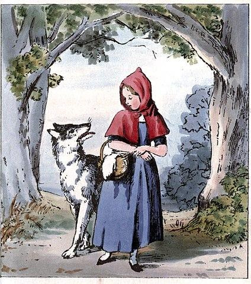

# El Lobo Feroz

Feroz, el lobo, se siente desnutrido y famélico y quiere un sistema para simular sus actividades diarias. Quiere mejorar su estado de salud, comiendo saludable y a la vez haciendo ejercicio para no excederse en su peso. 

## Requerimientos básicos:

1. Averiguar si feroz está saludable, lo que se deduce de que su peso esté entre 20 y 150 unidades. Se sabe que inicialmente pesa 10 unidades, por lo que no está saludable.

2. Que el lobo aumente (o disminuya) su peso en una cantidad de unidades indicada.

3. Que al lobo sufra una crisis que lo hace volver a su peso inicial. 

## Caperucita Roja:

1. Cuando feroz come algo su peso aumenta un 10% del peso ingerido. Por ejemplo, si se come una hamburguesa que pesa 20 aumenta 2. 

2. Cuando feroz va corriendo hasta un lugar, su peso disminuye 1 unidad, independientemente del lugar que sea. 

3. Por otra parte, está Caperucita, que pesa 60 y lleva una canasta. En determinado momento, en la canasta hay 6 manzanas (todas del mismo peso: 0.2) pero podría ser que dicha cantidad varíe. Su abuelita pesa siempre 50. 

4. Representar la siguiente versión de la historia del lobo Feroz:
El lobo va corriendo hasta el bosque. Allí se encuentra con Caperucita, conversan, pero no pasa nada más. Luego, el lobo corre a la casa de la abuelita y luego de comersela, se disfraza de ella.  Mientras tanto, Caperucita cruza el bosque y se le cae una manzana de su canasta. Cuando feroz ve llega a Caperucita a la casa, molesto por las preguntas incisivas sobre su aspecto físico, abre grande su boca y se come a Caperucita con canasta llena y todo. Finalmente, llega el cazador… ¿El lobo también se lo come de un bocado? ¿El cazador provoca una crisis en el lobo? ¿Qué otra cosa puede suceder? (Modelar al cazador de manera creativa, no trivial, y consistente con lo realizado anteriormente)

5. Averiguar cómo queda de saludable el lobo en los diferentes finales posibles. 

## Los chanchitos:

1. Cuando el lobo sople una casa, pierde tanto peso como la resistencia de la casa más el peso de los ocupantes. La casa de paja no resiste nada, la de madera tiene resistencia 5 y la de ladrillos resiste 2 por cada ladrillo.

2. Representar la historia (incompleta) de los chanchitos: 
El lobo sopla primero la casa de paja, donde hay un chanchito, la hace caer y el chanchito huye a la casa de madera donde estaba el otro chanchito. El lobo corre hasta la casa de madera, la sopla y también la tumba, por lo que ambos chanchitos huyen. ¿Cómo termina la historia? ¿Se come a alguno de los chanchitos?
3. Averiguar cómo queda de saludable feroz en los diferentes finales posibles. 

